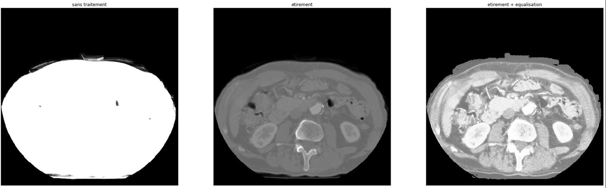
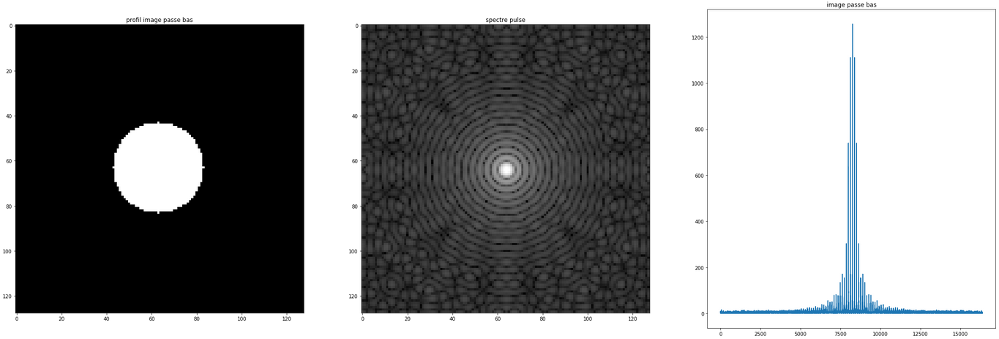
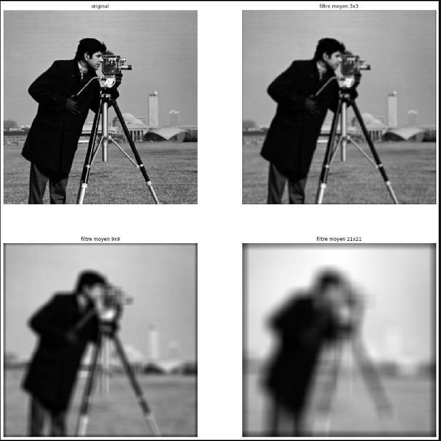
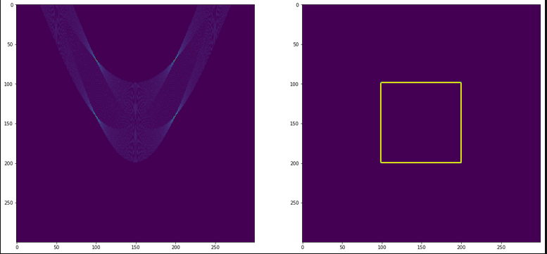
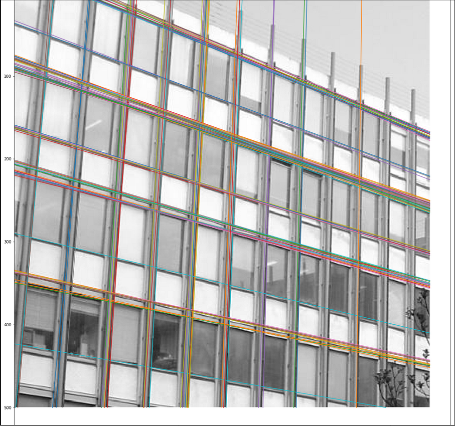
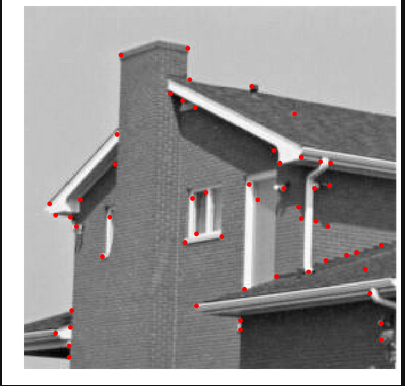

# Mounib's Computer vision journey

This Repository is the product of the journey i'm taking to learn computer vision.
You can find detailed jupyter notebooks, coding algorithms from scratch and explaining the math behind it.

# Subject Covered: 
  - Manipualting Images using PIL library
  - Image Color Histogram Stretching/Equalisation
  - Discrete Fourier Transform / frequency domain
  - Convolution / Image Filters 
  - Image Gradient / Edge detection
  - Harris Corner Detector
  - Hough Transoform / Line Detection / Parametric form detection
  - Image Segmentation / KMeans
  - Image Compression / JPEG / Huffman Encoding / Entropy

### Todos

 - Use the ideas and algorithms in a usefull appllicaiton
 - Use some library Opencv

License
----
MIT

